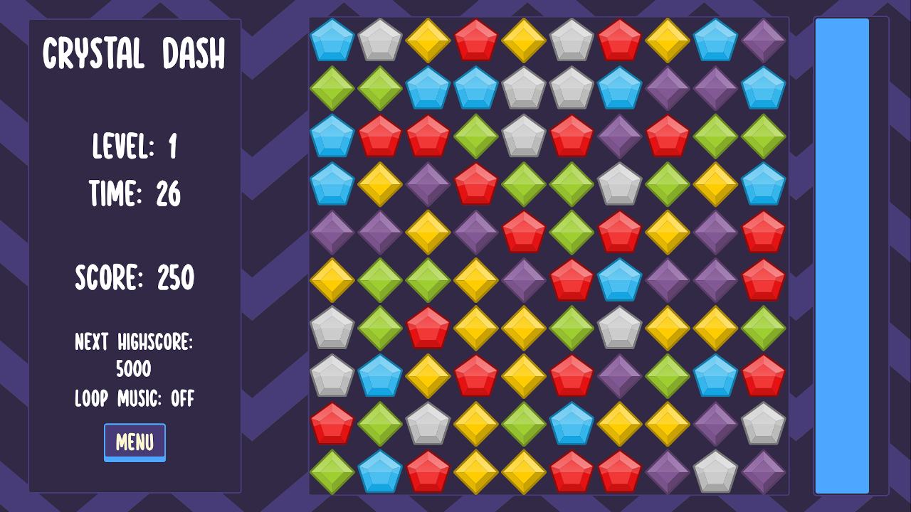

# Crystal Dash
A simple Bejeweled clone made in Godot

Play the game here: https://sp4r0w.itch.io/crystal-dash

### About
-------------
This is my first true game made in GDScript. It's a simple clone of the Bejeweled. Nothing too ambitious.   
I made this project to learn a bit about GDScript, and I guess for the first project it's alright? There's not too much to say about it to be honest, it's just Bejeweled.  

I did some small clean up and added comments but I haven't made any significant changes to the code.  
I uploaded this repo and preserved the game for me to look at how much I improve over time. Improving the code now, with my current knowledge defeats the point.  
However, you're free to improve upon this code if you wish to do so :)

### Getting Started
-------------
To compile this project, you will need at least Godot v3.5.1. Do not forget you will need the required export templates.   
More in-depth guide is avaiable here: https://docs.godotengine.org/en/stable/tutorials/export/exporting_projects.html  
You're free to modify the project as you wish.

### Credits
-------------
Thanks to DipShtick (Varga) for testing.  
Graphical assets were made by Kenney (https://kenney.nl/)  
UI assets were made by azagaya (https://azagaya.itch.io/)  
Music was made by Ben Burnes (https://twitter.com/ben_burnes)  

### Preview
-------------

Play the game here: https://sp4r0w.itch.io/crystal-dash
